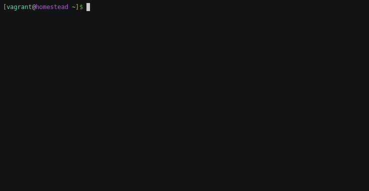

# `cmake-init` - The missing CMake project initializer

Opinionated CMake project initializer to generate CMake projects that are
FetchContent ready, separate consumer and developer targets, provide install
rules with proper relocatable CMake packages and use modern CMake (3.14+)



Here are some example outputs of the script as of 0.9.0:

* https://github.com/friendlyanon/cmake-init-executable
* https://github.com/friendlyanon/cmake-init-header-only
* https://github.com/friendlyanon/cmake-init-shared-static

There is also an example repository showing how to integrate with vcpkg:

* https://github.com/friendlyanon/cmake-init-vcpkg-example

## Goals

* Be simple to use  
  The script allows you to just mash enter to get you a correctly set up
  project for an executable. You want a header-only library? Choose `h` when
  prompted. Static/shared library? Just choose `s` when prompted. Simple
  **and** correct!
* Create [`FetchContent`][1] ready projects  
  This is important, because in the near feature this might allow CMake to
  consume other projects in a trivial fashion similar to other languages, e.g.
  in JavaScript's case (npm).
* Cleanly separate developer and consumer targets  
  This ties into the previous point as well, but developers and consumers of a
  project have different needs, and separating targets achieves that goal. A
  developer should be able to run tests, add warning flags, run benchmarks,
  etc., while a consumer, such as a package maintainer, generally only wants to
  build the library or the executable itself, without having to patch around in
  the CMake scripts. Show some love to your package maintainers!
* Use modern CMake (3.14+)  
  There are too many outdated and plain wrong examples on the internet, it's
  time to change that.
* Make usage of tools easy  
  Code coverage (gcov), code linting and formatting (clang-format), static
  analysis (clang-tidy) and dynamic analysis (sanitizers, valgrind) are all
  very helpful ways to guide the developer in creating better software, so they
  should be easy to use. There is also some level of support for [vcpkg][10] to
  make consuming dependencies from git repositories easier.

## Non-goals

* Cover every possible project structure  
  Doing this is pointless as an init script, because there are far too many
  ways people have been building software, and if you have special needs, you
  ought to already know CMake and you can set the project up yourself.
* Generate files and show tips for websites other than GitHub  
  While I understand the people who are against GitHub (and by proxy
  Microsoft), it's by far the most used website of its kind, the files and
  messages specific to it are small in number, and they are easily adapted for
  any other service.

## Install

Make sure you have these programs installed:

* Python 3.8 or newer
* CMake 3.19 or newer
* git
* [clang-tidy](#clang-tidy) (optional)
* [cppcheck](#cppcheck) (optional)
* [Doxygen](#doxygen) (optional)
* [LCOV](#lcov) (optional)

`cmake-init` consists of a single file that can be run using Python. Python was
chosen for this, because it is cross-platform, convenient for this use-case and
you likely already have it installed or the need for it will come up later
anyway.

You have to just download the `cmake-init.pyz` script from the [releases][4],
place it somewhere in your `PATH` and rename it to `cmake-init`. On Windows,
you have to create a `cmake-init.bat` file to proxy to the script:

```batch
@echo off

python %~dp0\cmake-init.pyz %*
```

### clang-tidy

[clang-tidy][5] is a static analysis tool that helps you spot logical errors in
your code before it is compiled. This script gives you the option to inherit
the `clang-tidy` preset in your `dev` preset, enabling the CMake integration
for this tool.

CI will always run clang-tidy for you, so it is entirely optional to install
and use it locally, but it is recommended.

**For Windows users**, if you wish to use clang-tidy, then you must install
[Ninja][6] and set the `generator` field in your `dev` preset to `Ninja`. The
reason for this is that only [Makefiles and Ninja][7] are supported with CMake
for use with clang-tidy. For other generators, this feature is a no-op.

### cppcheck

[cppcheck][8] is a static analysis tool similar to clang-tidy, however the
overlap in what they detect is minimal, so it's beneficial to use both of them.
This script gives you the option to inherit the `cppcheck` preset in your `dev`
preset, enabling the CMake integration for this tool.

CI will always run cppcheck for you, so it is entirely optional to install and
use it locally, but it is recommended.

**For Windows users**, if you wish to use cppcheck, then you must install
[Ninja][6] and set the `generator` field in your `dev` preset to `Ninja`. The
reason for this is that only [Makefiles and Ninja][9] are supported with CMake
for use with cppcheck. For other generators, this feature is a no-op.

### Doxygen

[Doxygen][11] is a tool to generate documentation from annotated source code.
In conjunction with it, [m.css][12] is used for presenting the generated
documentation.

The generated projects will have a `docs` target in developer mode, which can
be used to build the documentation into the `<binary-dir>/docs/html` directory.

After Doxygen is installed, please make sure the `doxygen` executable exists in
the `PATH`, otherwise you might get confusing error messages.

### LCOV

[LCOV][13] is a tool to process coverage info generated by executables that
were instrumented with GCC's `gcov`. This coverage info can be used to see what
parts of the program were executed.

The generated projects will have a `coverage` target in developer mode if the
`ENABLE_COVERAGE` variable is enabled. The reason why a separate target is used
instead of CTest's built-in `coverage` step is because it lacks necessary
customization. This target should be run after the tests and by default it will
generate a report at `<binary-dir>/coverage.info` and an HTML report at the
`<binary-dir>/coverage_html` directory.

**For Windows users**, the only way to get coverage reports is via the codecov
integration in the CI workflow or by using WSL or a Linux VM.

## Usage

* `cmake-init <path>`  
  This command will create a CMake project at the provided location and
  according to the answers given to the prompts. You may pass the `-s`, `-e` or
  `-h` flags after to quickly create a shared library, executable or a header
  only library respectively.
* `cmake-init --vcpkg <name>`  
  Generate a vcpkg port with the provided name in the `ports` directory to make
  consuming dependencies not in any central package manager's repository
  easier. This command must be run in a CMake project root tracked by git. See
  the vcpkg example at the top of the README for more details.
* `cmake-init --help`  
  Shows the help screen for more flags and switches.

## Licensing

[][2]  

`cmake-init` is Free Software: You can use, study, share and improve it at your
will. Specifically you can redistribute and/or modify it under the terms of the
[GNU General Public License][3] as published by the Free Software Foundation,
either version 3 of the License, or (at your option) any later version.

Files generated by `cmake-init` are placed under Public Domain. Everyone is
free to use, modify, republish, sell or give away these files without prior
consent from anybody. These files are provided on an "as is" basis, without
warranty of any kind. Use at your own risk! Under no circumstances shall the
author(s) or contributor(s) be liable for damages resulting directly or
indirectly from the use or non-use of these files.

[1]: https://cmake.org/cmake/help/latest/module/FetchContent.html
[2]: http://www.gnu.org/licenses/gpl-3.0.en.html
[3]: https://www.gnu.org/licenses/gpl.html
[4]: https://github.com/friendlyanon/cmake-init/releases
[5]: https://clang.llvm.org/extra/clang-tidy/
[6]: https://github.com/ninja-build/ninja
[7]: https://cmake.org/cmake/help/latest/prop_tgt/LANG_CLANG_TIDY.html
[8]: http://cppcheck.sourceforge.net/
[9]: https://cmake.org/cmake/help/latest/prop_tgt/LANG_CPPCHECK.html
[10]: https://github.com/microsoft/vcpkg
[11]: https://www.doxygen.nl/
[12]: https://mcss.mosra.cz/
[13]: http://ltp.sourceforge.net/coverage/lcov.php
